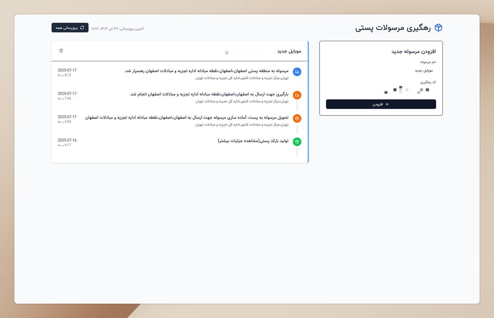

# رهگیری مرسولات پستی

[](https://github.com/yjavaherian/post-tracking/actions/workflows/docker-publish.yml)

یک برنامه وب ساده و خودمیزبان برای رهگیری مرسولات پستی در ایران، با استفاده از داده‌های سرویس رسمی پست جمهوری اسلامی ایران. این ابزار به شما کمک می‌کند تا با ارائه رابطی تمیز، سریع و کاربرپسند برای مشاهده وضعیت مرسولات پستی، همیشه از آخرین وضعیت بسته‌های خود مطلع باشید.



## ویژگی‌ها

- **پشتیبانی از چندین مرسوله:** پیگیری چندین مرسوله به صورت همزمان در یک مکان.
- **به‌روزرسانی خودکار داده:** داده‌های رهگیری به‌طور خودکار به‌روزرسانی می‌شود تا همیشه جدیدترین اطلاعات را داشته باشید.
- **به‌روزرسانی دستی:** گزینه به‌روزرسانی دستی برای دریافت جدیدترین داده‌ها در صورت نیاز موجود است.
- **رابط کاربری تمیز و واکنش‌گرا:** رابطی مدرن و سازگار با موبایل که با SvelteKit و Tailwind CSS ساخته شده است.
- **استقرار آسان:** کل برنامه را به عنوان یک کانتینر Docker واحد مستقر کنید.
- **متن‌باز:** پروژه کاملاً متن‌باز است و آماده مشارکت جامعه است.

## شروع: استقرار با Docker

ساده‌ترین راه برای اجرای این برنامه استفاده از تصاویر Docker از پیش ساخته شده است.

### پیش‌نیازها

- [Docker](https://docs.docker.com/get-docker/) و [Docker Compose](https://docs.docker.com/compose/install/) روی سرور شما نصب شده باشد.

### ۱. ایجاد فایل `compose.yml`

فایلی به نام `compose.yml` با محتوای زیر ایجاد کنید.

```yml
services:
  app:
    image: ghcr.io/yjavaherian/post-tracking:main
    ports:
      - '127.0.0.1:3000:3000'
    volumes:
      - data:/app/data
    environment:
      - DATABASE_URL=/app/data/sqlite.db
      - ORIGIN=http://localhost:3000
    restart: unless-stopped

volumes:
  data:
```

### ۲. اجرای برنامه

برنامه را با استفاده از Docker Compose شروع کنید:

```bash
docker compose up -d
```

رهگیری مرسولات پستی شما اکنون در حال اجرا است و در `http://localhost:3000` قابل دسترسی است.

## توسعه محلی

علاقه‌مند به مشارکت هستید؟ اینجا نحوه اجرای پروژه روی ماشین محلی شما آمده است.

### پیش‌نیازها

- [Node.js](https://nodejs.org/) (نسخه ۲۲ یا جدیدتر)
- [pnpm](https://pnpm.io/installation)

### ۱. کلون کردن مخزن

```bash
git clone https://github.com/yjavaherian/post-tracking.git
cd post-tracking
```

### ۲. نصب وابستگی‌ها

```bash
pnpm install
```

### ۳. تنظیم متغیرهای محیطی

فایل محیطی نمونه را کپی کنید:

```bash
cp .env.example .env
```

### ۴. اجرای سرور توسعه

پایگاه داده هنگام اولین اجرای برنامه به‌طور خودکار ایجاد و پیکربندی می‌شود.

```bash
pnpm dev
```

برنامه در `http://localhost:5173` قابل دسترسی خواهد بود.

## نحوه استفاده

1. کد رهگیری مرسوله خود را از رسید پستی دریافت کنید
2. در فرم سمت چپ، نام مرسوله و کد رهگیری را وارد کنید
3. روی دکمه "افزودن" کلیک کنید
4. سیستم به‌طور خودکار وضعیت مرسوله را از سایت پست رسمی دریافت خواهد کرد

## LICENSE

این پروژه تحت مجوز MIT مجوز دارد. برای جزئیات به فایل [LICENSE](LICENSE) مراجعه کنید.
